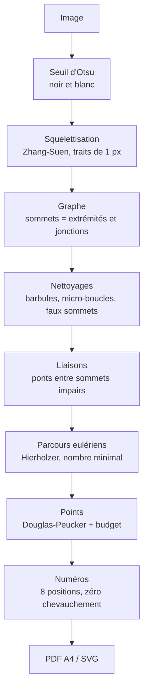

<div align="center">


# Traceur-compteur

**Le relier-les-points qui garde le tracé intérieur du dessin, pas seulement son contour.**

[](LICENSE)
[](#pourquoi-tout-tient-dans-le-navigateur)
[](#pourquoi-tout-tient-dans-le-navigateur)

</div>

---

## Le problème

Tous les générateurs de relier-les-points existants font la même chose : ils
extraient le **contour extérieur** et jettent tout le reste. Sur un coloriage de
lapin, ça veut dire perdre l'oeil, le museau, les moustaches, l'intérieur des
oreilles et les pattes.

Mesuré sur trois coloriages : **38 à 69 % de la longueur du dessin** part à la
poubelle. Là où un `findContours(RETR_EXTERNAL)` renvoie 10 à 33 boucles fermées
avec **zéro jonction**, ce moteur extrait 171 à 431 traits et jusqu'à 174
jonctions.

## Pourquoi ce n'est pas un défaut de qualité, mais de format

Un contour extérieur est une boucle fermée : une seule séquence `1 → N`, sans
ambiguïté. Dès qu'on garde l'intérieur, le dessin devient un **graphe avec des
embranchements**, et le théorème d'Euler interdit de le parcourir d'un seul
trait : chaque sommet de degré impair force une fin de séquence.

La réponse est donc un puzzle en **plusieurs séquences, en nombre minimal
démontré**. La numérotation reste continue de 1 à N, et un anneau signale les
endroits où lever le crayon. L'habitude du 1-2-3 est préservée.

Pour éviter de multiplier ces levers, le moteur **relie les traits qui s'arrêtent
juste avant de se toucher** : une moustache qui frôle le contour, un poil qui
s'interrompt. Chaque liaison supprime une séquence, et comme la limite est une
distance, les objets réellement éloignés restent séparés tout seuls.

## Ce que ça donne

Mesuré sur trois coloriages, à 250 points par page A4 :

| | lapin endormi | deux lapins | trois lapins |
|---|---:|---:|---:|
| Tracé intérieur conservé | 69 % | 55 % | 38 % |
| Traits extraits | 171 | 292 | 431 |
| Jonctions trouvées | 81 | 121 | 174 |
| Sortie d'un contour seul | 19 boucles | 10 boucles | 33 boucles |
| Séquences sans liaisons | 39 | 50 | 69 |
| **Séquences avec liaisons** | **16** | **26** | **29** |
| Numéros superposés | 0 | 0 | 0 |
| Fidélité, écart max en A4 | 1,29 mm | 1,65 mm | 3,17 mm |
| Temps de calcul | 196 ms | 218 ms | 285 ms |

## Démarrer

```sh
make install
make start      # http://localhost:1234
```

Dépose un dessin au trait, règle le nombre de points, et **télécharge le PDF**.

Le PDF est la sortie recommandée : une page A4 exacte, à l'échelle prévue, sans
l'en-tête ni la pagination que le navigateur ajoute à l'impression. Une page web
ne peut pas les désactiver, c'est un réglage du dialogue d'impression, alors le
PDF est écrit directement.

Le réglage qui marche : **environ 250 points, 2,5 mm d'espacement, 8 mm de
liaisons**.

## Comment ça marche



L'étape que personne ne fait est la **troisième** : construire un vrai graphe du
squelette, avec ses embranchements, au lieu de suivre un contour. Tout le reste
en découle.

### Pourquoi tout tient dans le navigateur

Le moteur fait **2 500 lignes** et n'a **aucune dépendance de calcul** : ni
OpenCV, ni WASM, ni modèle. React ne sert qu'à l'interface. Les algorithmes
utilisés ont tous été publiés avant OpenCV et tiennent chacun sur une page :

| Étape | Algorithme | Année |
|---|---|---|
| Seuillage | Otsu | 1979 |
| Squelettisation | Zhang-Suen | 1984 |
| Parcours | Hierholzer | 1873 |
| Simplification | Douglas-Peucker | 1973 |
| Distance au fond | chamfer 3-4 | 1966 |

Conséquence directe : **ton image ne quitte jamais ton poste.** Le navigateur la
décode, tout le reste se calcule chez toi.

## Bien choisir son image

- **Idéal** : dessin au trait noir sur fond blanc (coloriage, encrage, logo).
- **Recadrer les filigranes** : un logo de site consomme des dizaines de points.
- **Photos** : non prises en charge. L'outil est pensé pour les dessins au trait,
  une photo donne un puzzle confus.

## Limites connues

- Le budget de points est compté **avant** le retrait des numéros incasables : on
  finit parfois sous la cible. Le curseur reste un ordre de grandeur.
- Les liaisons ajoutent des traits absents de l'image. C'est assumé et mesuré ;
  au-delà de 12 mm elles cessent de prolonger le dessin pour le redessiner.
- Sur un dessin très dense, deux traits distants de 2 mm portent forcément des
  pastilles proches. Les numéros, eux, ne se chevauchent jamais.

## Développer

```sh
make check      # build + format + lint + typecheck + knip + tests
make bench      # mesure les images de référence et écrit out/
make og         # régénère l'image de partage
make help       # toutes les commandes
```

L'architecture, les décisions prises et les pièges rencontrés sont documentés
dans [AGENTS.md](AGENTS.md).

## Déployer

Le site est statique : `make build` produit `dist/`, à servir tel quel.

Une seule chose à adapter, **`VITE_SITE_URL` dans `.env`** : les aperçus de
partage ont besoin d'URL absolues, et un robot de réseau social ne peut pas
deviner le domaine. Si l'image d'aperçu apparaît cassée alors que le titre passe,
c'est presque toujours ça.

## Licence

[MIT](LICENSE)
